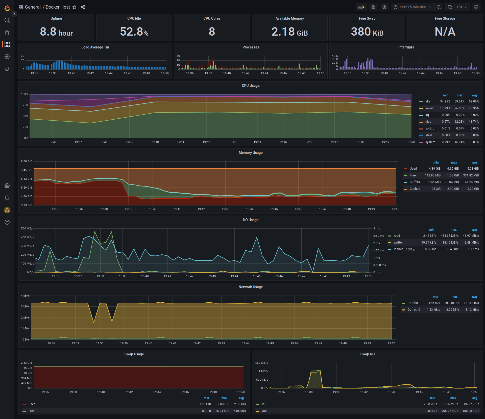
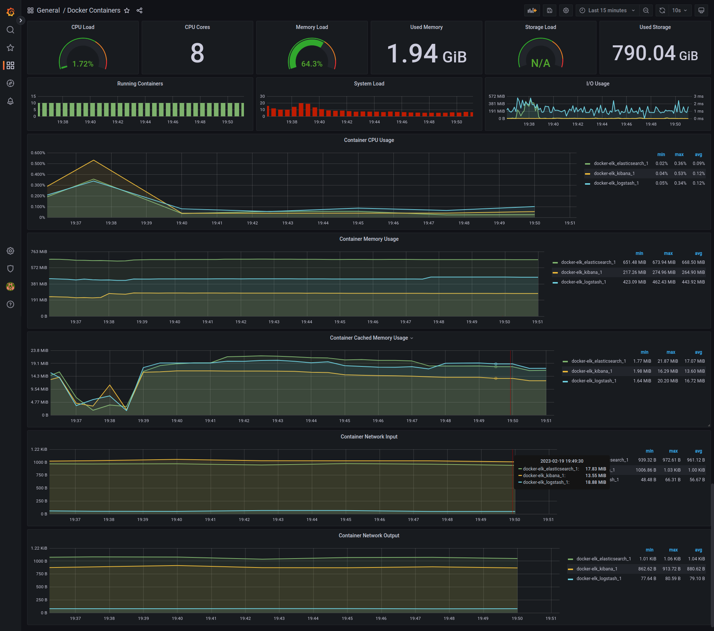
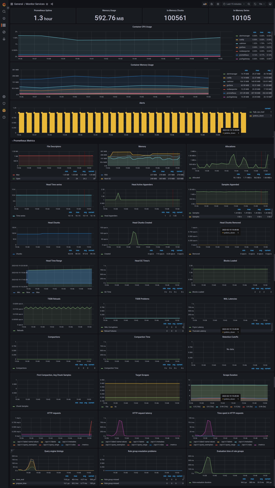

### Info
This project is based on q fork of two docker container images : docker-elk, dockerprom
### Goal
Goal is to monitor local host and containers' metrics like cpu usage, memory usage, http requests, network conenctions ...
### Results
screen captures in out/ 

http://localhost:3000/?orgId=1 

playlist/dashboards/ 

### Docker Host

### Docker Containers

### Monitor services

